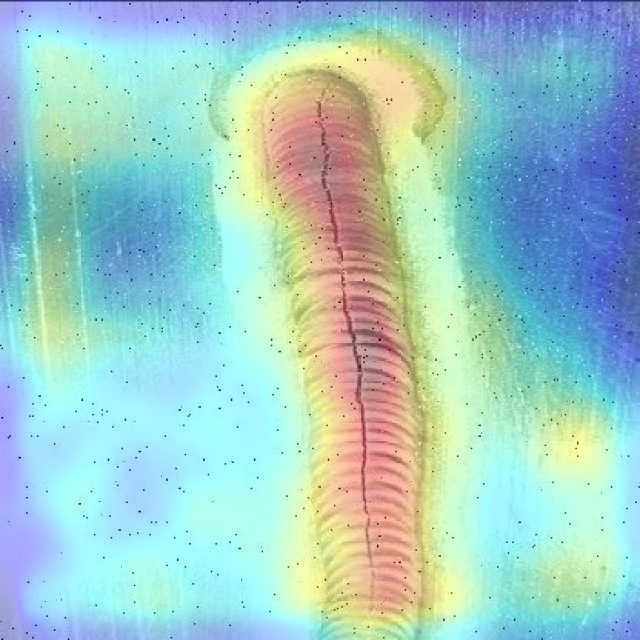

# Welding Anomaly Detection – PatchCore PoC

This repository presents an industry-oriented Proof of Concept (PoC) for
automated weld inspection using unsupervised computer vision techniques.
The goal is to improve process reliability and reduce manual inspection
effort in manufacturing environments.

## Problem Statement
Manual weld inspection is time-consuming, subjective, and difficult to
scale. In real manufacturing settings, labeled defect data is scarce
and new defect types frequently emerge, making supervised approaches
hard to maintain.

## Solution Overview
This PoC uses an unsupervised anomaly detection approach:
- Train PatchCore **only on normal (good) weld images**
- Detect deviations from learned normal patterns as anomalies
- Produce both **anomaly scores** and **pixel-level explainable heatmaps**

This design allows detection of unseen defects without relying on
explicit defect labels.

## System Pipeline
Weld Image → Preprocessing → PatchCore Model → Anomaly Score + Heatmap → Decision

## Model & Methodology
PatchCore learns feature embeddings from normal weld images and builds a
compact memory representation. During inference, weld images are scored
based on their deviation from learned normal patterns, while heatmaps
highlight localized defect regions for explainability.

## Tech Stack
- PyTorch
- Anomalib (PatchCore)
- OpenCV
- NumPy

## Current Status
- Model training completed
- Inference pipeline validated
- Threshold-based decision logic implemented
- Demo-ready qualitative results generated

## Demo Results

### Normal Weld (Clean)

### Defective Weld (High Confidence Anomaly)

## Future Scope
- Real-time camera or video-based inspection
- Adaptive threshold calibration per weld type
- MLOps integration for monitoring and retraining
- Dashboard and BI integration for quality monitori
